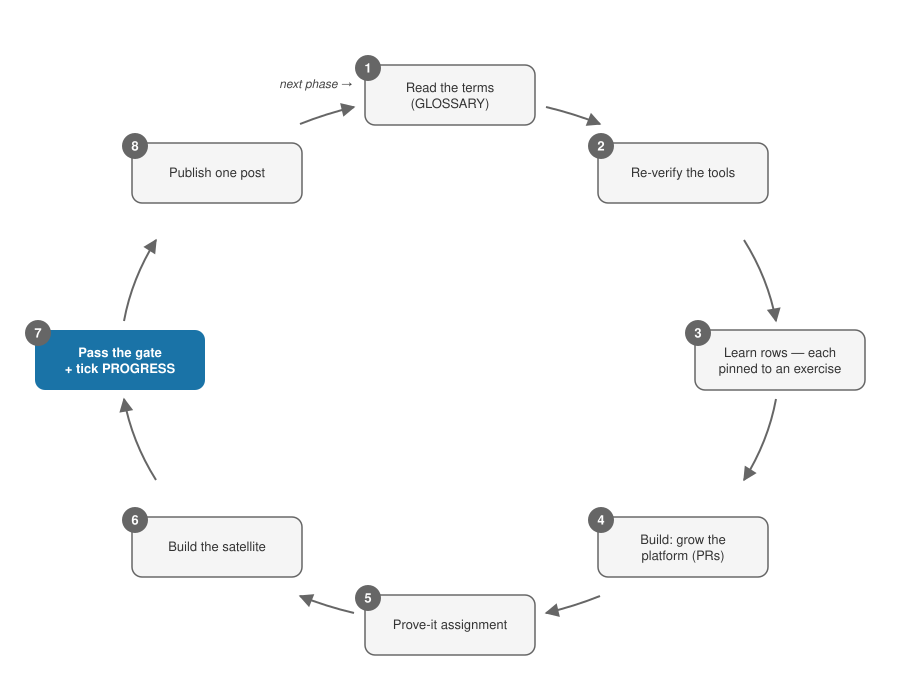

# The Guide — exactly what to do, in order

This file assumes nothing. Follow it top to bottom. When it says open a file, open that file.

Jump: [Day 0](#day-0--set-yourself-up) · [The phase loop](#the-phase-loop) · [Using the built-in skills](#using-the-built-in-skills) · [Getting a unique project brief](#getting-a-unique-project-brief) · [Coming back after a break](#coming-back-after-a-break) · [Every week](#every-week) · [Standing rules](#standing-rules)

## Day 0 — set yourself up

Time needed: about 30 minutes. Do these in order.

1. **Make a GitHub account** if you don't have one: [github.com/signup](https://github.com/signup).
2. **Fork this repo.** On the repo's GitHub page, click **Fork** (top right), then **Create fork**. You now have your own copy.
3. **Clone your fork:** `git clone https://github.com/YOUR-USERNAME/DE-projects.git`
4. **Read [README.md](README.md)** top to bottom. It's short.
5. **Pick your starting phase.** Most people start at Phase 0 — if that's you, skip to step 7. Already an experienced data person? Open [reference/LEARNERS.md](reference/LEARNERS.md), section **"Placement — entering at the right phase"**, and follow its numbered steps.
6. *(If you're not starting fresh at Phase 0 — or you forked a used copy)* **Reset the tracker.** Open [PROGRESS.md](PROGRESS.md) in your editor. Clear every evidence table, date, and log row. It's yours now.
7. **Stamp your start.** In [PROGRESS.md](PROGRESS.md), fill in **"Started:"** with today's date. Commit and push.
8. **Read the [Standing rules](#standing-rules)** at the bottom of this guide. They apply all year.
9. **Open [phases/phase-0-orientation/README.md](phases/phase-0-orientation/README.md)** and start [the phase loop](#the-phase-loop). Phase 0 itself walks you through installing every tool and creating every account — you don't need to prepare anything else today.

### Accounts and money, the whole year

Don't create these on Day 0 — each phase tells you when. This is the complete list so nothing surprises you:

| What | Cost | Arrives in |
|---|---|---|
| GitHub · AWS (with a `de-framework` IAM profile + $25/mo budget alarm) | free / ≤ $25/mo | P0 |
| DataLemur + LeetCode · dbt Learn | free | P1 |
| Udemy (Maarek DEA course ~$15–20 on sale) · Tutorials Dojo ($15) · AWS Skill Builder (optional $29 for 1 month) · **AWS DEA-C01 exam $150** | see left | P2 |
| Databricks Free Edition · Databricks Academy · Derar Alhussein course (~$30–40) · **Databricks exam $200 → $100 with voucher** | see left | P3 |
| Astronomer Academy · Dagster University | free | P4 |
| Confluent Developer (free courses + free certificate) | free | P5 |
| Optional books: PySpark (Rioux ~$33) · DDIA 2E · FoDE (~$45, P0) | optional | P0/P3/P6 |
| Optional video-lane courses ([catalog + prices](reference/COURSES.md)) — Udemy twins ~$15–25 each · Coursera $49/mo | optional — a $0 default lane always exists; not in the total below | any phase |
| Communities for external critique: r/dataengineering, dbt Slack, DataTalksClub Slack | free | from G2 |

**Total for the year:** AWS ≤ $25/month + certifications ~$310–455 ([breakdown](reference/CERTS.md)).

## The phase loop

Every phase README has the same sections, in the same order. Work them like this. "The phase README" means the file you opened, e.g. `phases/phase-2-aws-lakehouse-core/README.md`.

1. **Read the header and Objectives.** The top lines tell you the months, the hours, and what it costs. **Objectives** tells you what you'll be able to do at the end. Read nothing else yet.
2. **Run the re-verify checks.** At the end of the Learn section there's an italic line starting *"Before starting, re-verify."* Tools change; do those checks now, before you invest hours.
3. **Learn the words first.** Open [GLOSSARY.md](GLOSSARY.md) and find this phase's section (the terms tagged `[P0]`, `[P1]`, …). Read every term and explain it out loud in your own words. From Phase 1 on, quiz yourself with the Anki deck you built in Phase 0 — or run the **`/quiz` skill**.
4. **Work the Learn table, top to bottom, one row at a time.** Each row names a resource, how much of it to do, and — in the **"Pinned by"** column — the exercise that locks it in. Finish the row's exercise before starting the next row. Never bank rows to "exercise later." **Some phases add a second, video-lane table** under the default one — vetted video twins of named rows, catalogued with prices in [reference/COURSES.md](reference/COURSES.md). For each row it names, pick **one** lane *before you start the row*, then do that lane's resource and the row's exercise. The lane you didn't pick is your fallback — open it only when you're stuck. Never work both lanes of one row; hours swap, they never add.
5. **Do the Build steps in order.** This grows your platform repo. Every change: make a branch, open a PR, review it yourself, squash-merge. Each phase has an **"AI rule"** line — it says what AI may write and what you must type by hand. Follow it exactly.
6. **Do the Prove-it assignment.** Some phases fold it into a build step; do it wherever the phase README puts it.
7. **Build the satellite(s).** Two ways: follow the satellite section as written (the default — it's complete), or get a unique brief via [the generator](#getting-a-unique-project-brief).
8. **Run the gate.** Open the phase README's **"Competency gate"** section — that checklist is the single source of truth. Go item by item; for each one, produce the evidence it names — a screenshot, a video, a link. (The **`/gate-check` skill** tells you exactly what's still missing.) This includes writing this phase's answers into your `SELF-CHECK.md`.
9. **Log it in [PROGRESS.md](PROGRESS.md).** Fill this phase's evidence table (item → link), run the **retrieval checkpoint** (all this phase's terms + 10 random earlier ones — `/quiz` does it), log the score, and fill in **"Gate passed on:"** with the date.
10. **Publish.** The phase README's **"Publish checkpoint"** section describes one post — any public platform. Draft it from your own README/artifacts, post it, log the link.
11. **Move on.** Click the bold **"Next:"** link at the bottom of the phase README. Start this loop again at step 1.

Stuck or behind schedule? That's expected, not failure. See [the hour math and the trim rules](reference/WHY.md) — and never trim the platform or the certs.

## Using the built-in skills

If you use [Claude Code](https://code.claude.com/docs) in your fork, six skills ship with it (in `.claude/skills/`). Type the slash-command in any session:

| Skill | What it does |
|---|---|
| `/start-phase` | Walks you through the phase loop for your current phase, one step at a time |
| `/quiz` | Runs a retrieval checkpoint (all current-phase terms + 10 earlier), scores it |
| `/gate-check` | Compares the phase's gate checklist against your PROGRESS.md and lists what's missing |
| `/satellite-brief` | Generates a unique satellite brief — writes the 3 requirement files, keeps the solution sealed |
| `/explain` | Teaches any term or tool from the framework, with one check question |
| `/resume` | Re-enters after a break: re-quiz, objectives, three warm-up tasks |

No Claude Code? Everything has a manual path: the glossary quiz by cover-the-definition, the gate by reading the checklist, the generator by [the paste-in prompt](prompts/generate-satellite-requirements.md).

## Getting a unique project brief

Use this when you want a satellite project with a realistic business scenario nobody else has. Skip it freely — the default satellite specs are complete.

**Easy way:** run the **`/satellite-brief` skill** with your satellite's id (S1, S2, S3a, S3b, S4a, S4b, S5, S6a, S6b). It writes three files and tells you where they landed. Done.

**Manual way:**

1. Open [prompts/generate-satellite-requirements.md](prompts/generate-satellite-requirements.md).
2. Copy the **entire file**, from the top down to the line `# Satellite catalog — Fixed blocks`.
3. Below that line, find the **one block** for your satellite — e.g. `## S2 — Cost-aware Athena mart (Phase 2)` — and copy **that block only**.
4. Paste both into your AI assistant, prompt first, block underneath. Use an assistant that can read your fork (it needs your `PROGRESS.md` and any earlier `requirements.md` files, so scenarios don't repeat).
5. Save the outputs where the prompt says (`requirements/` in your satellite repo). **The third file is sealed — don't read it.** The prompt explains how to keep it sealed with a chat-only assistant.
6. Build from the first two files. The satellite's objectives and gate artifact from the phase README still apply unchanged.
7. After your build passes the acceptance tests: open the sealed file, compare, write the 5-line delta note.

A complete worked example of what good outputs look like: [prompts/example/](prompts/example/README.md).

## Coming back after a break

Illness, work crunch, Ramadan — breaks happen. Don't restart the phase; re-enter it. (The **`/resume` skill** runs all three steps.)

1. Re-run your **last retrieval checkpoint** (same terms — Anki deck or `/quiz`). Log the score.
2. Re-read the **Objectives** section of your current phase README.
3. Do one 30-minute warm-up task: a small PR — fix a link, add a test.

Momentum comes back in an evening. A guilt-driven restart costs weeks.

## Every week

- Log your hours in PROGRESS.md's **Weekly hours log** (honest numbers — the log itself is an artifact).
- Once a month: screenshot the AWS bill into the **Spend log**, confirm ≤ $25.

## Standing rules

These apply all year, in every phase:

- **Gates decide advancement** — never the calendar.
- **Nothing is learn-only** — every resource ends in an exercise, build, or written artifact.
- **Every platform change goes through a PR** — branch → PR → self-review → squash-merge, even solo.
- **No secret ever enters git** — gitleaks pre-commit from day one; a real secrets backend from P4.
- **Teardown after every chargeable lab** — each lab lists its cost cap and deadline.
- **AWS ≤ $25/month** — budget alarm + monthly screenshot.
- **One public post per phase** — drafted from the publish checkpoint, any platform.

---
[README](README.md) · [Progress](PROGRESS.md) · [Why it looks this way](reference/WHY.md)
