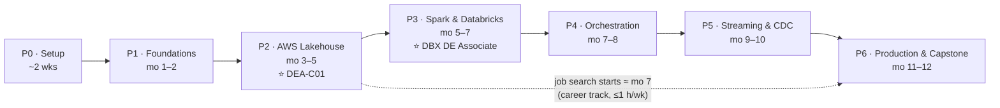

# The Data Engineer Framework (2026–2027)

A 12-month, competency-gated framework for becoming a properly trained data engineer — combining **courses, certifications, and projects** around one evolving AWS Lakehouse platform. Built from six deep-research reports (tool landscape, cert blueprints, courses, platform case studies, roadmap benchmarks, job market — see [`sources/research/`](sources/research/)), a full audit of earlier planning materials, and an independent expert audit of the framework itself ([`sources/DE-audit.md`](sources/DE-audit.md)) whose findings are folded into this revision.

> **Who this is for:** an AWS SAA-certified professional with strong SQL and data-modeling skills, ~6–10 focused hours/week, targeting a data-engineer role transition (Saudi/Gulf-first, remote-global second). Different profile or starting point? [`LEARNERS.md`](LEARNERS.md) covers placement, forking, and re-deriving the market assumptions for your region.

---

## The destination

Where this framework ends, and how you'll know you arrived:

**Associate Data Engineer, role-ready** — defined not by finishing a curriculum but by holding evidence for all seven competency gates (G0–G6). Concretely, by the end you can design, build, operate, and explain a batch + streaming lakehouse end-to-end; prove your data is correct; say what it costs to run; and answer every interview question in this repo from your own artifacts. The full gate→competency matrix lives in [`LEARNERS.md`](LEARNERS.md); the evidence tracker is [`PROGRESS.md`](PROGRESS.md).

Along the way, front-loaded deliberately: **both certifications are done by ≈ month 7** — AWS DEA-C01 at the Phase-2 gate (≈ month 4–5, while the SAA substrate is freshest), Databricks DE Associate at the Phase-3 gate (≈ month 6–7). That's when the **job search starts** — mid-year, with two certs and a live platform, not at month 12 ([why](CERTS.md)).

## The route there

You build **one platform all year** — the **spine**: an AWS Lakehouse (S3 + Iceberg/S3 Tables + Glue + Athena + dbt + Airflow) that grows a new capability each phase, exactly the way real teams grow theirs (validated against 7 real platform-build case studies, including [Tweeq's](sources/research/platform-journeys.md)). Around it, each phase adds one or two **satellite projects** for tool diversity (Databricks/Delta, Dagster, Debezium, ClickHouse + Superset, an AI/RAG data pipeline). Every phase follows the same rhythm — **Learn → Build → Gate** — and you advance when you pass the **competency gate**, not when the calendar says.

```
 P0          P1              P2 ⭐            P3 ⭐           P4              P5              P6
 Orientation Foundations     AWS Lakehouse   Spark &         Orchestration   Streaming       Production,
 & Setup     SQL·Python·dbt  Core            Databricks      & Ingestion     & CDC           Serving & Capstone
 ~2 wks      Mo 1–2          Mo 3–5          Mo 5–7          Mo 7–8          Mo 9–10         Mo 11–12
 ──────────  ──────────────  ──────────────  ──────────────  ──────────────  ──────────────  ─────────────────
 env setup   SPINE v0.1:     SPINE v1:       Databricks      SPINE v2:       SPINE v3:       SPINE v4: quality,
 lifecycle   local lakehouse S3·Glue·Athena  Free Edition    Airflow 3,      Kafka event     lineage, Terraform,
 glossary    DuckDB·Iceberg  S3 Tables       labs (Lakeflow, dlt, DMS CDC,   path, stream    observability
 bootcamp    dbt 3 layers    dbt-athena      UC, medallion)  Kinesis         → Iceberg       ────────────────
 Anki tool   SCD2·MODELING   exam mini-labs  ─────────────   ─────────────   ─────────────   SATELLITES:
             ─────────────   ─────────────   SATELLITES:     SATELLITES:     SATELLITE:      ClickHouse+Superset
             SATELLITE:      SATELLITE:      Spark forensics Redshift hybrid Debezium vs     (or data product) ·
             first dbt       cost-aware      Iceberg-vs-     Dagster vs      DMS comparison  AI/RAG data pipeline
             project         Athena mart     Delta bake-off  Airflow                         ────────────────
 GATE:       GATE:           GATE: ⭐        GATE: ⭐        GATE:           GATE:           GATE: capstone
 env demo +  local demo +    AWS DEA-C01     DATABRICKS      orchestrated    CDC artifact +  rubric + portfolio
 20 terms    dbt docs graph  + spine live    DE ASSOCIATE    spine + CDC     stream demo     + mock interviews
                             (mo 4–5)        (mo 6–7)        demos
             └─ + 2 buffer weeks in half 1 ─┘               └─ + 2 buffer weeks in half 2 ─┘
```

Same map as a diagram (renders on GitHub mobile):



Each phase's full spec lives in [`phases/`](phases/):
[Phase 0](phases/phase-0-orientation/README.md) · [Phase 1](phases/phase-1-foundations/README.md) · [Phase 2](phases/phase-2-aws-lakehouse-core/README.md) · [Phase 3](phases/phase-3-spark-databricks/README.md) · [Phase 4](phases/phase-4-orchestration-ingestion/README.md) · [Phase 5](phases/phase-5-streaming/README.md) · [Phase 6](phases/phase-6-production-serving/README.md)

### The honest hour math

The phase budgets sum to **~473 hours** (18 + 70 + 88 + 80 + 72 + 65 + 80), plus ~30–35 h of career track ≈ **~505 h total**. Against the stated pace:

| Weekly pace | Total duration | Verdict |
|---|---|---|
| 9–10 h/week | ~12 months | The 12-month arc, with modest slack |
| 8 h/week | ~15 months | Fine — gates don't care about calendars |
| 6 h/week | ~20 months | Also a win — same destination, later arrival |

Both outcomes are wins; the title says 12 months, the gates say "when you're ready." Two **buffer weeks per half-year** are planned into the map (slack is scheduled, not stolen). If time runs short, the **pre-authorized trim path** — cut in this order, nothing else: ① satellite S4a (Redshift hybrid — the P2 taste lab + exam theory already cover it), ② the Polars and Flink labs, ③ satellite S1 (the spine already teaches dbt from zero). **The spine and both certs are never trimmed.**

### The career track (parallel, ≤1 h/week from Phase 2)

Gulf/Saudi hiring runs 2–5 months from application to offer, so the search starts inside the framework: **G2** (DEA passed) — LinkedIn rewritten, `JOB-SEARCH.md` watchlist of Saudi/Gulf data teams started; **G3** (Databricks passed) — resume v1 from evidence, first outreach, first mock interview; **P4 onward** — 3–5 targeted applications/month, interview feedback feeding `INTERVIEW.md` as curriculum; **P6** — polish, ≥3 mocks, capstone-grade portfolio surface. Every gate from G2 also requires **requesting external critique** of the phase artifact from a practitioner community — the framework never grades itself alone.

### Publishing (build in public, one post per phase)

Each phase ends with a LinkedIn post drafted from its publish checkpoint — the year's arc in ~9 posts: the commitment stake (P0, optional) → the local lakehouse (P1) → the cost story + DEA announcement (P2) → the cert + Spark forensics story (P3) → Airflow-vs-Dagster honestly compared (P4) → the CDC showdown (P5) → the full platform tour, pinned (P6). Posts pair with one interactive act each (answer a community question, comment substantively) — visibility *and* relationships.

## The default path — and generated variants

The specs in [`phases/`](phases/) are the framework's **default path**: complete and self-sufficient — datasets chosen, resources vetted, budgets estimated, gates defined. Following it requires generating nothing.

For anyone entering at a different point, running the framework as a group, or wanting project briefs nobody else has: [`LEARNERS.md`](LEARNERS.md) (placement protocol, level guarantee, forking) and [`prompts/generate-satellite-requirements.md`](prompts/generate-satellite-requirements.md) (unique, realistic satellite requirements with the objectives and gates held fixed — same bar, different road).

## Inventories — everything the framework uses

| Inventory | Where | Contents at a glance |
|---|---|---|
| **Tools** | [`TOOLS.md`](TOOLS.md) | ~30 CORE (hands-on, scheduled) · ~27 AWARE (concepts, ≤1 day) · 12 SKIP (with reasons) — every tool linked to its official docs, the source of truth |
| **Datasets** | [`DATASETS.md`](DATASETS.md) | The spine's datasets (NYC TLC taxi + zones, weather API, Citi Bike GBFS, seeded OLTP) + per-satellite menus incl. Saudi/Gulf options (data.gov.sa, Tadawul, Umrah/Hajj) + practice-question banks |
| **Certifications** | [`CERTS.md`](CERTS.md) | AWS DEA-C01 (gate G2, ≈ mo 4–5) · Databricks DE Associate (gate G3, ≈ mo 6–7) — blueprints, prep plans, vouchers, timing rationale |
| **Glossary** | [`GLOSSARY.md`](GLOSSARY.md) | Every term the phases use, taught as contrast pairs, tagged by phase — feeds the P0 Anki generator and every retrieval checkpoint |

**Accounts you'll need** (all free unless noted): GitHub · AWS (with a dedicated `de-framework` IAM profile + $25 budget alarm from P0) · Databricks Free Edition · dbt Learn · Astronomer Academy · Confluent Developer · DataLemur + LeetCode · Tutorials Dojo ($15) · Udemy (Maarek course owned; Derar ~$30–40 on sale) · Exponent (free tier) · the communities used for external critique (r/dataengineering, dbt Slack, DataTalksClub Slack).

**Local toolchain:** a machine that runs Docker comfortably · uv · Docker + Compose · VS Code · Git + gitleaks pre-commit (from P0) · Astro CLI (arrives P4) · Terraform (arrives P6).

**Money, the whole year:** AWS ≤ **$25/month** (budget alarm + teardown discipline from day zero; per-lab caps in P4) · certifications **~$295–435 total** ([breakdown](CERTS.md)) · optional books: PySpark (Rioux, ~$33), DDIA 2E.

## How to use this framework

1. **Work one phase at a time.** Open the phase README. It always has the same sections: *Objectives → New terminology → Learn (each resource pinned to an exercise) → Build (spine increment) → Prove-it assignment → Build (satellite) → Career track → Competency gate → Publish checkpoint → Interview questions.*
2. **Learn before you build — and pin everything you learn.** Each phase front-loads a bounded learning block, and **nothing is learn-only**: every resource maps to a build step, lab, code assignment, or written artifact that pins it. If it isn't exercised, it isn't learned.
3. **The gate decides when you move on.** Each gate is a named artifact you can demo plus a short retrieval checkpoint on *earlier* phases' terms (spaced repetition — the mechanism every public roadmap lacks). Track gates in [`PROGRESS.md`](PROGRESS.md); after a dark stretch, use its **resume ritual** instead of restarting.
4. **Work via PRs from day one.** Every spine change: branch → PR → self-review → squash-merge. A year of PR history reads as an operated platform.
5. **Publish per phase, not per week.** One post per phase, drafted from the publish checkpoint. Build in public without the treadmill.
6. **Use AI deliberately.** Scaffold, explain, quiz — but hand-type each phase's core artifacts. The per-phase rule:

| Phase | AI may | You hand-type |
|---|---|---|
| P0 | Explain concepts, debug setup | Every shell command |
| P1 | Scaffold project structure, Makefile | Every dbt model, the PyIceberg drill, the ingester tests |
| P2 | IAM policy JSON, workflow YAML | Glue transform logic, dbt incremental configs, the pytest+moto suite |
| P3 | Quiz you from the exam guide | All lab notebooks — AI may not write lab code |
| P4 | Operator boilerplate, setup scripts | DAG structure, dlt config, secrets wiring, MERGE logic |
| P5 | Compose files, producer scaffolding | Consumer logic, the idempotent sink, the event-time window |
| P6 | Terraform boilerplate | Contract definitions, the runbook |

7. **Cost posture:** ≤ **$25/month** AWS, enforced by budget alarms, `make destroy` teardown, per-lab caps, and a mid-phase billing check in P4. **Secrets posture:** no secret ever enters git (gitleaks from P0; a real secrets backend from P4).

## Why this framework looks the way it does

| Design choice | Evidence behind it |
|---|---|
| One evolving platform, not 30 disconnected weekly projects | Every roadmap failure-mode study flags the "capstone cliff" and tutorial hell; every real team builds one platform incrementally ([roadmap benchmarks](sources/research/roadmap-benchmarks.md), [platform journeys](sources/research/platform-journeys.md)). The old 30-project plan is audited in [`sources/audit-30-projects.md`](sources/audit-30-projects.md) — the good projects survive as satellites. |
| Competency gates, not deadlines | Calendar-gated plans cascade when life happens. Gates are named artifacts + retrieval checks; slipping 2 weeks costs nothing. |
| Both certs in the first half of the year | Gulf hiring cycles run 2–5 months; ATS signals must exist when applications start (≈ mo 7), and the SAA substrate (~25% of DEA) decays with time. The exams' hands-on gaps are bought down with P2 mini-labs; P4 then deepens the same services *after* the exam ([full reasoning](CERTS.md)). |
| A terminology on-ramp in every phase | The #1 reported problem with tool-dense plans is terminology overwhelm. Every phase lists its new terms first, linked to [`GLOSSARY.md`](GLOSSARY.md), taught as contrast pairs. |
| Every learn-resource pinned to an exercise | Passive watching is the other half of tutorial hell. Each Learn row names the drill, assignment, or written artifact that exercises it. |
| AWS-first, Databricks second, open-source satellites | AWS leads DE job postings globally (40.3%) and in KSA; Gulf postings conspicuously pair Databricks + PySpark; AWS's in-Kingdom region lands 2026 ([job market](sources/research/job-market.md)). |
| Airflow deep, Dagster taste | Airflow is #1 in every demand source; Dagster is the credible challenger worth one satellite ([tools](sources/research/tool-landscape.md)). |
| Streaming late, batch first | "Default to batch, justify streaming" — and every surveyed roadmap puts Kafka/streaming last of the core topics. |
| Portfolio > certs | Certs appear in only ~4% of postings; fewer than 1 in 10 junior candidates show any portfolio. The spine + satellites *are* the differentiator; the two certs are milestones, not the goal — which is also why there are 2, not 4. |
| External feedback built into the gates | Solo learners systematically miss their own gaps. From G2 every gate requires requesting community critique; the first mock interview lands at G3, not month 11. |
| An AI-data module at the end | LLM-pipeline skills jumped ~3% → ~12% of DE postings in one year and compound with Vision-2030 hiring — a differentiator, not the spine. |

## Principles (read once, re-read when stuck)

1. **SQL and Python are the permanent spine** — they appear in 70–94% of postings; every phase keeps exercising them.
2. **Idempotency + retries is the reliability model.** Re-runnable jobs, MERGE-upsert semantics, orchestrator retries, alerts. The highest lesson-density skill across all seven real-platform case studies.
3. **Many small jobs, never a mega-DAG.** Two teams independently regretted the monolith DAG within a year.
4. **Three modeling layers from day one** (staging → intermediate → marts). Two teams independently regretted two.
5. **Table maintenance is the lakehouse's hidden cost** — compaction, snapshot expiry, schema evolution are first-class learning objectives, not footnotes.
6. **Concepts are the skeleton; tools are replaceable leaves.** When a tool churns (they will), the phase objective survives.
7. **Anything you build must survive weeks of your inattention** — prefer serverless over self-hosted; the framework never asks you to run Kubernetes.
8. **Nothing is learn-only.** Every piece of information is pinned to an exercise, assignment, or written artifact — unexercised knowledge evaporates.
9. **Ship the phase, then improve it.** A gate passed at "good" beats a phase polished forever.

## Explicit skip-list (and why)

You will **not** study these this year — each was evaluated and cut deliberately (full verdicts in [`TOOLS.md`](TOOLS.md)):
- **Hadoop/HDFS ops, Hive-only patterns** — legacy; concepts arrive via Spark/Glue anyway.
- **Prefect, Kestra** — a third Python orchestrator adds no employability over Airflow + Dagster.
- **Apache Hudi** — niche upsert estates; Iceberg + Delta cover the concepts.
- **StarRocks/Doris** — a second OLAP engine adds nothing at entry level; ClickHouse covers the category.
- **Kubernetes administration** — not a DE entry requirement; serverless covers this year.
- **Scala** — PySpark first; revisit only if a target employer demands it.
- **Deep Flink** — one Flink SQL lab (Phase 5); stateful streaming depth is a post-job specialization.
- **A third cloud** — one light Azure-vocabulary lab (Phase 6) hedges the Saudi enterprise market; no Azure builds.
- Also skipped as credentials: a third certificate (incl. the DeepLearning.AI DE Specialization) and pre-P1 SQL video courses — reasoning in [`CERTS.md`](CERTS.md).

## Repo map

| File | What it is |
|---|---|
| [`GLOSSARY.md`](GLOSSARY.md) | The terminology on-ramp — every term, contrast-pair taught, tagged by phase |
| [`TOOLS.md`](TOOLS.md) | The tool universe: CORE/AWARE/SKIP verdicts, official-docs links, phase placement, cert mapping |
| [`DATASETS.md`](DATASETS.md) | Every dataset used or offered, per phase/satellite, with sources and sizes |
| [`CERTS.md`](CERTS.md) | Both cert blueprints, study plans, exam timing + the resequencing rationale, vouchers |
| [`PROGRESS.md`](PROGRESS.md) | Competency-gate tracker, career log, hours/spend logs, retrieval checkpoints, resume ritual |
| [`LEARNERS.md`](LEARNERS.md) | Placement protocol, the gate→competency matrix, forking guide, cohort use |
| [`prompts/`](prompts/) | The requirements generator: unique satellite briefs with objectives + gates held fixed |
| [`CONTRIBUTING.md`](CONTRIBUTING.md) | What's welcome via PR vs what needs an issue first |
| [`SOURCES.md`](SOURCES.md) | Research bibliography + audit verdicts |
| [`phases/`](phases/) | One folder per phase: the executable spec (the default path) |
| [`sources/`](sources/) | Original materials, the six research reports, the audits, this revision's inputs |
| [`LICENSE`](LICENSE) | CC-BY-4.0 — fork it, adapt it, credit it |

---

*Framework compiled 2026-08-20 from research current to that date; revised the same week after an independent expert audit ([`sources/DE-audit.md`](sources/DE-audit.md)) and an improvement review ([`sources/improvements-v1.md`](sources/improvements-v1.md)). Tool versions and cert blueprints churn — each phase README notes what to re-verify before starting it, a weekly link-check Action guards the references, and the structure is concept-keyed precisely so tool churn doesn't invalidate it. Forking? Start at [`LEARNERS.md`](LEARNERS.md) and re-derive the market assumptions for your region from [`sources/research/`](sources/research/).*
