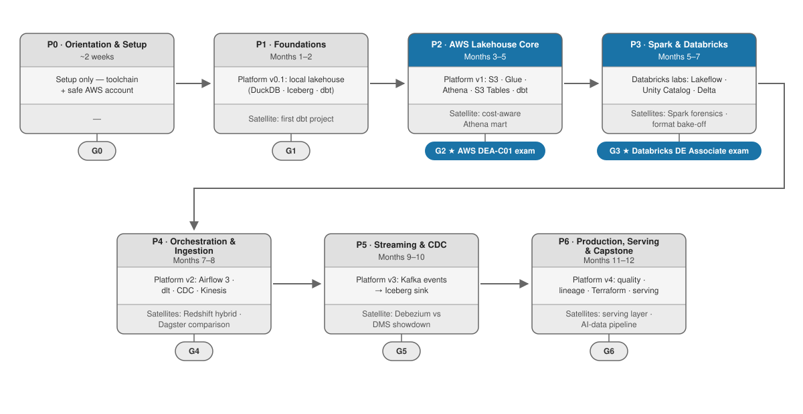

# The Data Engineer Framework

A 12-month path to becoming a data engineer. You build **one real platform**, phase by phase — a full data stack, end to end: ingestion, lakehouse storage, transformation, orchestration, quality, serving. You move forward by passing **gates** (things you built and can demo), not by watching the calendar.

By month 12 you have the kind of platform real data teams write [public journey posts](https://engineering.tweeq.sa/tweeq-data-platform-journey-and-lessons-learned-clickhouse-dbt-dagster-and-superset-fa27a4a61904) about — and you'll have written yours.

Built for someone with solid SQL and basic cloud familiarity, spending 6–10 hours a week. Different starting point? See [placement](reference/LEARNERS.md). Curious why it's built this way? Every design decision is explained in [WHY.md](reference/WHY.md).

## ▶ Start here

New here? Don't read this whole repo. Open **[GUIDE.md](GUIDE.md)** — it walks you through your first day and every phase after it, step by step.

1. Do the [Day 0 setup](GUIDE.md#day-0--set-yourself-up) (about 30 minutes).
2. Open [Phase 0](phases/phase-0-orientation/README.md) and follow [the phase loop](GUIDE.md#the-phase-loop).
3. Track everything in [PROGRESS.md](PROGRESS.md).

## The route

| Phase | When | What you build | Gate |
|---|---|---|---|
| [0 — Orientation & Setup](phases/phase-0-orientation/README.md) | ~2 weeks | Working toolchain, guard-railed AWS account | G0 · demo + terms quiz |
| [1 — Foundations](phases/phase-1-foundations/README.md) | Months 1–2 | A lakehouse on your laptop (DuckDB · Iceberg · dbt) | G1 · local demo |
| [2 — AWS Lakehouse Core](phases/phase-2-aws-lakehouse-core/README.md) | Months 3–5 | The same lakehouse on AWS (S3 · Glue · Athena · S3 Tables) | **G2 ⭐ AWS DEA-C01 exam** |
| [3 — Spark & Databricks](phases/phase-3-spark-databricks/README.md) | Months 5–7 | Spark fluency + Databricks labs | **G3 ⭐ Databricks DE exam** |
| [4 — Orchestration & Ingestion](phases/phase-4-orchestration-ingestion/README.md) | Months 7–8 | Airflow 3, dlt, CDC, Kinesis on the platform | G4 · orchestrated demos |
| [5 — Streaming & CDC](phases/phase-5-streaming/README.md) | Months 9–10 | Kafka event path → lakehouse; Debezium-vs-DMS showdown | G5 · streaming demos |
| [6 — Production, Serving & Capstone](phases/phase-6-production-serving/README.md) | Months 11–12 | Quality, lineage, Terraform, serving layer, AI pipeline | G6 · capstone + journey post |

Each phase also builds one or two **satellite projects** (separate repos) for tool diversity — Databricks, Dagster, Debezium, ClickHouse + Superset, an AI/RAG pipeline.

## How you work a phase

Every phase has the same shape. You repeat this loop seven times:

1. Read the phase's new terms in [GLOSSARY.md](GLOSSARY.md).
2. Work through the Learn table — each resource comes with an exercise; some rows offer a [video alternative](reference/COURSES.md) (pick one lane, never both).
3. Build: grow the platform, then build the phase's satellite.
4. Pass the gate: demo your work, quiz yourself, log evidence in [PROGRESS.md](PROGRESS.md).
5. Move to the next phase.

The full click-by-click version is in [GUIDE.md](GUIDE.md#the-phase-loop). If you use Claude Code, six built-in skills (`/start-phase`, `/quiz`, `/gate-check`, `/satellite-brief`, `/explain`, `/resume`) automate the repetitive parts — [see the guide](GUIDE.md#using-the-built-in-skills).

## Tracking progress

[PROGRESS.md](PROGRESS.md) is your only tracker. Every phase has an evidence table there; an item counts only when you link proof — a repo, a screenshot, a video. Coming back after a break? Use the [comeback ritual](GUIDE.md#coming-back-after-a-break) instead of starting over.

## What it costs

AWS: at most **$25/month**, protected by a budget alarm you set on day one. Exams and courses: **~$310–455** for the whole year. The complete accounts-and-money list is in [GUIDE.md](GUIDE.md#accounts-and-money-the-whole-year).

## Repo map

| Where | What |
|---|---|
| [`GUIDE.md`](GUIDE.md) | The operating manual — exactly what to do, in order |
| [`PROGRESS.md`](PROGRESS.md) | Your evidence tracker (fork it, make it yours) |
| [`GLOSSARY.md`](GLOSSARY.md) | Every term, plainly defined, tagged by phase |
| [`phases/`](phases/) | The seven phase specs — the default path |
| [`reference/`](reference/) | Consulted, not read cover-to-cover: [WHY](reference/WHY.md) · [TOOLS](reference/TOOLS.md) · [DATASETS](reference/DATASETS.md) · [CERTS](reference/CERTS.md) · [COURSES](reference/COURSES.md) · [LEARNERS](reference/LEARNERS.md) · [SOURCES](reference/SOURCES.md) |
| [`prompts/`](prompts/) | The satellite-requirements generator + a worked example |
| [`report/`](report/) | The introduction handbook — a printable A4 overview for readers and reviewers ([HTML](report/index.html) · [PDF](report/DE-Framework-Handbook.pdf)) |
| [`.claude/skills/`](.claude/skills/) | The six built-in helper skills |
| [`sources/research/`](sources/research/) | The research reports behind every claim |
| [`CHANGELOG.md`](CHANGELOG.md) · [`CONTRIBUTING.md`](CONTRIBUTING.md) · [`LICENSE`](LICENSE) | Revision history · how to contribute · CC-BY-4.0 |

---
*Tool versions and cert blueprints churn: each phase lists what to re-verify before starting, and a weekly link-check guards the references. Forking or entering midway? Start at [reference/LEARNERS.md](reference/LEARNERS.md).*
