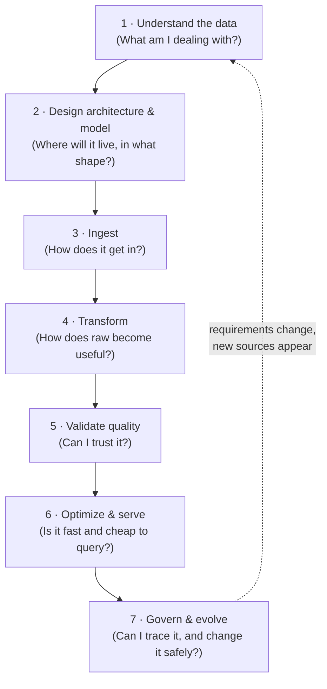

# Data Engineering Fundamentals — Organized by the DE Project Lifecycle

> **What this is:** All the concepts from Section 1 (Data Engineering Fundamentals, slides 12–75) of the Maarek/Kane DEA-C01 course, reorganized in the order you would actually meet them when building a real data engineering project — instead of the course's original order.
>
> **How to use it:** When you start (or imagine) a DE project, walk the stages top-to-bottom. Each concept tells you three things: **what it is** (the course content), **when you use it in a project** (the practical trigger), and **on AWS** (which service implements it — a preview of the course sections you'll study next).

---

## The DE Project Lifecycle at a Glance

Every data engineering project answers the same chain of questions, in roughly this order:



| Stage | Key question | Concepts (from the course) | Typical AWS services |
|---|---|---|---|
| 1. Understand the data | What types, how much, how fast? | Types of data; Volume/Velocity/Variety | — (analysis, not tools) |
| 2. Design & model | Warehouse, lake, or both? What schema? What file format? | Warehouse vs Lake, Lakehouse, Data Mesh, data modeling (star schema), CSV/JSON/Avro/Parquet, schema evolution | S3, Redshift, Lake Formation, Glue Schema Registry |
| 3. Ingest | How does data enter my platform? | Data sources (JDBC/ODBC, APIs, logs, streams); batch vs streaming | Kinesis, DMS, Glue, AppFlow |
| 4. Transform | How do I clean and reshape it? | ETL/ELT, pipeline orchestration, sampling, data skew | Glue, EMR, Lambda, Step Functions, MWAA, EventBridge |
| 5. Validate quality | Is the output trustworthy? | Validation & profiling (completeness, consistency, accuracy, integrity) | Glue Data Quality |
| 6. Optimize & serve | Is it fast and cheap for consumers? | Indexing, partitioning, compression | Redshift, Athena, S3 partitioning |
| 7. Govern & evolve | Where did this data come from? What if the schema changes? | Data lineage; schema evolution (operational side) | Glue + Neptune + Spline, Glue Schema Registry, DataZone |
| Always | — | SQL (Appendix A), Git (Appendix B) | Athena/Redshift; CodeCommit/GitHub |

> **Why this order matters:** decisions cascade. The *type* and *properties* of your data (Stage 1) determine whether you build a lake or a warehouse (Stage 2), which determines whether you run ETL or ELT (Stage 4), which determines what you optimize (Stage 6). Skipping Stage 1 and jumping straight to tools is the classic beginner mistake.

---

# Stage 1 — Understand the Data

*Before choosing any technology, characterize what you're dealing with. Everything downstream depends on the answers you produce here.*

## 1.1 Types of Data *(slides 13–16)*

### Structured Data
- **Definition:** Data organized in a defined manner or schema, typically found in relational databases.
- **Characteristics:** easily queryable; organized in rows and columns; has a consistent structure.
- **Examples:** database tables, CSV files with consistent columns, Excel spreadsheets.
### Unstructured Data
- **Definition:** Data that doesn't have a predefined structure or schema.
- **Characteristics:** not easily queryable without preprocessing; may come in various formats.
- **Examples:** free-form text files, videos and audio files, images, emails and word-processing documents.
### Semi-Structured Data
- **Definition:** Data not as organized as structured data, but with some level of structure in the form of tags, hierarchies, or other patterns.
- **Characteristics:** elements might be tagged or categorized in some way; more flexible than structured data but not as chaotic as unstructured data.
- **Examples:** XML and JSON files; email headers (structured fields like date/subject + unstructured body); log files with varied formats.
**When to use this in a project:** This is literally your first task — inventory every data source and label it structured / semi-structured / unstructured. The answer decides Stage 2: mostly structured → a warehouse can work; any mix → you need a lake (or lakehouse). It also decides how much transformation work (Stage 4) is ahead of you: unstructured data always needs preprocessing before it's queryable.

**On AWS:** structured → relational stores (RDS, Redshift); semi-structured → DynamoDB, S3 + Athena; unstructured → S3 (with services like Textract/Comprehend to extract structure later).

## 1.2 Properties of Data — the "3 Vs" *(slides 17–20)*

### Volume
- **Definition:** The amount or size of data an organization deals with at any given time.
- **Characteristics:** may range from gigabytes to petabytes or more; challenges in storing, processing, and analyzing high volumes.
- **Examples:** a social media platform processing terabytes daily from posts, images, and videos; retailers holding years of transaction data amounting to petabytes.
### Velocity
- **Definition:** The speed at which new data is generated, collected, and processed.
- **Characteristics:** high velocity requires real-time or near-real-time processing; rapid ingestion and processing can be critical.
- **Examples:** IoT sensors streaming readings every millisecond; high-frequency trading where milliseconds matter.
### Variety
- **Definition:** The different types, structures, and sources of data.
- **Characteristics:** data can be structured/semi-structured/unstructured and come from multiple sources in various formats.
- **Examples:** a business analyzing relational databases (structured) + emails (unstructured) + JSON logs (semi-structured); healthcare combining medical records, wearables, and feedback forms.
**When to use this in a project:** Ask three sizing questions for every source you inventoried in 1.1: *How much? How fast? How diverse?*
- **Volume** drives storage choice and cost planning (Stage 2) and partitioning strategy (Stage 6).
- **Velocity** is the single biggest fork in the road: low velocity → batch pipelines; high velocity → streaming pipelines (Stages 3–4). Decide this early — batch and streaming architectures look very different.
- **Variety** reinforces the lake-vs-warehouse decision from 1.1.
**On AWS:** volume → S3 scales effectively without limits; velocity → Kinesis (streaming) vs Glue/Batch (batch); variety → data lake on S3.

---

# Stage 2 — Design the Architecture & Model the Data

*Now you know your data; decide where it will live and in what shape. These are design-time decisions — expensive to reverse later, so they come before any building.*

## 2.1 Data Warehouse *(slides 22–23)*

- **Definition:** A centralized repository optimized for analysis, where data from different sources is stored in a **structured** format.
- **Characteristics:**
  - Designed for complex queries and analysis
  - Data is cleaned, transformed, and loaded (ETL process)
  - Typically uses a star or snowflake schema
  - Optimized for read-heavy operations
- **Examples:** Amazon Redshift, Google BigQuery, Azure SQL Data Warehouse.
- **Course example architecture:** clickstream data + purchase data + catalog data flow into a central warehouse, which then feeds purpose-specific **data marts** (accounting mart, analysis mart, machine-learning mart). A data mart is a smaller, subject-focused slice of the warehouse serving one team or use case.
## 2.2 Data Lake *(slide 24)*

- **Definition:** A storage repository holding vast amounts of **raw data in its native format** — structured, semi-structured, and unstructured.
- **Characteristics:**
  - Stores large volumes of raw data without a predefined schema
  - Data is loaded as-is, no preprocessing needed
  - Supports batch, real-time, and stream processing
  - Can be queried for transformation or exploration purposes
- **Examples:** Amazon S3 (used as a lake), Azure Data Lake Storage, HDFS.
## 2.3 Warehouse vs. Lake — the comparison *(slide 25)*

| Dimension | Data Warehouse | Data Lake |
|---|---|---|
| **Schema** | Schema-on-**write** (defined before writing) → ETL | Schema-on-**read** (defined when reading) → ELT |
| **Data types** | Primarily structured | Structured *and* unstructured |
| **Agility** | Less agile (predefined schema) | More agile (accepts raw data) |
| **Processing** | ETL (Extract → Transform → Load) | ELT (Extract → Load → Transform), or just Load for storage |
| **Cost** | Typically more expensive (optimized for complex queries) | Cost-effective storage; costs rise when processing large amounts |

## 2.4 Choosing between them *(slide 26)*

**Use a Data Warehouse when:**
- You have structured data sources and require fast, complex queries
- Data integration from different sources is essential
- Business intelligence and analytics are the primary use cases
**Use a Data Lake when:**
- You have a mix of structured, semi-structured, or unstructured data
- You need a scalable, cost-effective way to store massive amounts of data
- Future needs are uncertain and you want flexibility in storage and processing
- Advanced analytics, machine learning, or data discovery are key goals
**In practice (and on the exam):** organizations often use **both** — ingest raw data into a lake, then process and move refined data into a warehouse for analysis. This "lake first, warehouse second" pattern is the default architecture for most modern projects.

**When to use this in a project:** This is *the* central architecture decision, made once per project, right after Stage 1. Take your source inventory: all structured + BI use case → warehouse; anything else or uncertain future → lake (or both). Write the decision down — every later stage references it.

**On AWS:** lake → **S3 + Glue Data Catalog + Athena**; warehouse → **Redshift**; the combined pattern → S3 lake feeding Redshift.

## 2.5 Data Lakehouse *(slide 27)*

- **Definition:** A hybrid architecture combining the best of lakes and warehouses — the performance, reliability, and capabilities of a warehouse with the flexibility, scale, and low-cost storage of a lake.
- **Characteristics:**
  - Supports both structured and unstructured data
  - Allows both schema-on-write and schema-on-read
  - Serves both detailed analytics and machine-learning tasks
  - Typically built on cloud or distributed architectures
  - Benefits from technologies like **Delta Lake**, which bring **ACID transactions** to big data
- **Examples:** AWS Lake Formation (with S3 + Redshift Spectrum), Delta Lake, Databricks Lakehouse Platform, Azure Synapse Analytics.
**When to use this in a project:** Choose it when the warehouse-vs-lake decision in 2.4 genuinely ends in "we need both behaviors on the same data" — e.g., ML teams need raw files while analysts need fast SQL with transactional guarantees, and you don't want to maintain two copies.

**On AWS:** **Lake Formation** over S3, queried via **Redshift Spectrum**/**Athena**; open table formats (e.g., Iceberg) appear later in the course under S3 Tables/Glue.

## 2.6 Data Mesh *(slide 28)*

- **Definition/idea:** Coined in 2019 — it's about **governance and organization**, not a specific technology.
- **Key points:**
  - Individual teams own "**data products**" within a given **domain**
  - Data products serve various "use cases" around the organization
  - "Domain-based data management"
  - **Federated governance** with central standards
  - Self-service tooling and infrastructure
  - Lakes, warehouses, etc. *may be part of it* — a data mesh is a **data-management paradigm**, not an architecture
**When to use this in a project:** Not a decision for a single pipeline — it matters when you're organizing *many* teams' data. As a solo learner/builder, just recognize it: if an exam question talks about domain ownership, decentralized data products, or federated governance, the answer is "data mesh."

**On AWS:** **Amazon DataZone** (covered later) is AWS's data-mesh-style governance service; Lake Formation permissions support the federated model.

## 2.7 Data Modeling — star schema & ERD *(slide 39)*

- The exam guide doesn't go deep on specific data models, but you should know the **star schema**:
  - **Fact tables** — the measurable events (sales, clicks), one row per event
  - **Dimension tables** — descriptive context around facts (customer, product, date)
  - Linked by **primary / foreign keys**
- A diagram of these relationships is an **Entity Relationship Diagram (ERD)**.
**When to use this in a project:** Once you've chosen a warehouse (or lakehouse), you model *before* loading data — the schema-on-write decision in 2.3 requires the schema to exist. Model facts and dimensions from the questions the business wants answered ("revenue per product per month" → sales fact + product & date dimensions). If you chose a pure lake, modeling is deferred to Stage 4/6, when you shape curated tables.

**On AWS:** the star schema is how you design **Redshift** tables; fact/dimension thinking also drives Athena/Glue curated-zone table design.

## 2.8 Common Data Formats *(slides 34–38)*

*You choose file formats at design time — for each zone of the platform (raw, intermediate, curated) — because format determines cost, speed, and compatibility everywhere downstream.*

### CSV (Comma-Separated Values)
- **Description:** Text-based, tabular — each line is a row, values separated by commas (or other delimiters).
- **When to use:** small-to-medium datasets; data interchange between systems with different technologies; human-readable/editable storage; importing/exporting from databases or spreadsheets.
- **Systems:** SQL databases, Excel, Pandas, R, many ETL tools.
### JSON (JavaScript Object Notation)
- **Description:** Lightweight, text-based, human-readable format representing structured or semi-structured data as key-value pairs.
- **When to use:** data interchange between web server and client; configuration files; use cases needing a flexible schema or nested structures.
- **Systems:** web browsers, most languages, RESTful APIs, NoSQL databases like MongoDB.
### Avro
- **Description:** **Binary** format that stores both the data **and its schema**, so it can be processed later by different systems without the original system's context.
- **When to use:** big data and real-time processing systems; when **schema evolution** is needed; efficient serialization for transporting data between systems.
- **Systems:** Apache Kafka, Spark, Flink, Hadoop ecosystem.
### Parquet
- **Description:** **Columnar** storage format optimized for analytics, with efficient compression and encoding schemes.
- **When to use:** analyzing large datasets with analytics engines; when you read specific columns rather than entire records; storing data on distributed systems where I/O and storage need optimization.
- **Systems:** Hadoop ecosystem, Spark, Hive, Impala, Amazon Redshift Spectrum.
**Which format when — quick decision table:**

| Situation in your project | Pick | Why |
|---|---|---|
| Humans need to open/edit it; small data; spreadsheet exchange | CSV | Universal, readable |
| API payloads, configs, nested/flexible records | JSON | Flexible schema, nested structures |
| Data **in motion** between systems / streaming records; schema will change | Avro | Row-oriented binary + embedded schema |
| Data **at rest** for analytics; big scans of few columns | Parquet | Columnar → less I/O, better compression, cheaper queries |

A very common real pipeline: **ingest as JSON/CSV (raw zone) → transform → store curated zone as Parquet**.

**On AWS:** Athena and Redshift Spectrum are dramatically cheaper/faster on **Parquet** (they scan fewer bytes); Kinesis/MSK streams pair naturally with **Avro** + Glue Schema Registry; Glue jobs convert between all of these.

## 2.9 Schema Evolution — design-time view *(slide 42)*

- **Description:** The ability to adapt and change the schema of a dataset over time **without disrupting existing processes or systems**.
- **Importance:**
  - Data systems can adapt to changing business requirements
  - Allows addition, removal, or modification of columns/fields
  - Maintains backward compatibility with older data records
**When to use this in a project:** Think about it **now**, at design time, even though the change happens later: pick formats that support evolution (Avro, Parquet — see 2.8), and plan a schema registry from day one. Retrofitting evolution onto a pipeline that assumed a frozen schema is painful. (The operational side — what to do when change actually arrives — is Stage 7.)

**On AWS:** **Glue Schema Registry** — schema discovery, compatibility checking, validation, registration.

---

# Stage 3 — Ingest from Data Sources

*The platform design exists; now connect the real sources and land the data.*

## 3.1 Data Sources *(slide 33)*

- **JDBC** (Java Database Connectivity)
  - Platform-independent, **language-dependent** (Java-based)
- **ODBC** (Open Database Connectivity)
  - Platform-dependent (needs drivers), **language-independent**
- **Raw logs** — application/server log files
- **APIs** — pulling data from external/internal services
- **Streams** — continuous feeds of events
**When to use this in a project:** For every source from your Stage 1 inventory, pick the connection method:
- Relational databases → JDBC/ODBC connectors
- SaaS tools and web services → APIs
- Servers and applications → ship their raw logs
- Real-time events (clicks, IoT, transactions) → streams
Then apply the **velocity** decision from Stage 1 to each source: is it ingested in **batches** (nightly/hourly loads — simpler, cheaper) or as a **stream** (continuous — needed only when consumers genuinely need fresh data)?

**On AWS:** JDBC/ODBC → Glue connections, DMS (database migration/replication); APIs → AppFlow (SaaS), Lambda; logs → Kinesis Data Firehose, CloudWatch Logs; streams → **Kinesis Data Streams** / **MSK (Kafka)**.

---

# Stage 4 — Transform (ETL / ELT)

*Raw data has landed; turn it into something clean, consistent, and shaped for analysis. This is where data engineers spend most of their time.*

## 4.1 ETL Pipelines *(slides 29–31)*

- **Definition:** ETL = **Extract, Transform, Load** — the process used to move data from source systems into a data warehouse.
### Extract
- Retrieve raw data from source systems: databases, CRMs, flat files, APIs, or other repositories
- Ensure **data integrity** during extraction
- Can run in **real time or in batches**, depending on requirements
### Transform
Convert the extracted data into a format suitable for the target warehouse. Typical operations:
- **Data cleansing** — removing duplicates, fixing errors
- **Data enrichment** — adding data from other sources
- **Format changes** — date formatting, string manipulation
- **Aggregations/computations** — totals, averages
- **Encoding/decoding** data
- **Handling missing values**
### Load
- Move transformed data into the target warehouse or another repository
- In **batches** (all at once) or **streaming** (as data becomes available)
- Ensure data maintains its **integrity** during loading
**ETL vs ELT — tying it back to Stage 2:** your architecture decision already made this choice for you. Warehouse (schema-on-write) → **ETL**: transform *before* loading. Lake (schema-on-read) → **ELT**: load raw first, transform later inside the platform. The combined lake+warehouse pattern does both: EL into the lake, then T on the way to the warehouse.

**When to use this in a project:** This is the build phase — one pipeline per source (or per target table). For each: define the extract (Stage 3 connection), list the transform operations the data needs (use the checklist above against what you learned profiling the data), and define the load target and mode (batch/streaming).

**On AWS:** **AWS Glue** is the flagship ETL service; also EMR (Spark) for heavy lifting and Lambda for light event-driven transforms.

## 4.2 Managing (Orchestrating) ETL Pipelines *(slide 32)*

- Pipelines **must be automated in some reliable way** — not run by hand.
- AWS Glue, plus orchestration services:
  - **EventBridge** (event-driven triggers)
  - **Amazon MWAA** (Managed Workflows for Apache Airflow)
  - **AWS Step Functions**
  - **Lambda**
  - **Glue Workflows**
- (Specific architectures come later in the course.)
**When to use this in a project:** As soon as you have more than one step, you need orchestration: scheduling ("run at 2 AM"), dependencies ("load only after transform succeeds"), retries, and alerts on failure. Set this up when you build the pipeline, not after it breaks silently.

**On AWS:** simple schedule/event trigger → EventBridge; step-by-step state machine → Step Functions; complex DAGs / existing Airflow skills → MWAA; Glue-only pipelines → Glue Workflows.

## 4.3 Data Sampling Techniques *(slides 44–47)*

- **Random Sampling** — everything has an equal chance of selection.
- **Stratified Sampling** — divide the population into homogeneous subgroups (**strata**, e.g., product categories: Books, Music, Apparel…), then random-sample *within each stratum* → guarantees every subgroup is represented.
- **Systemic (systematic) Sampling** — take every *n*-th record.
- **Others:** cluster, convenience, judgmental sampling.
**When to use this in a project:** Sampling appears at two moments:
1. **Before building transforms** — profile a sample of a huge dataset instead of scanning all of it (fast, cheap exploration).
2. **While debugging/testing pipelines** — develop against a sample, then run on full data.
Pick **random** when data is uniform; pick **stratified** when you must not miss small-but-important subgroups (e.g., rare event types); **systematic** is a cheap approximation when data has no periodic ordering.

**On AWS:** Glue DataBrew and Athena (`TABLESAMPLE`) support sampling during profiling and query.

## 4.4 Data Skew *(slides 48–49)*

- **Definition:** The **unequal distribution or imbalance of data across nodes or partitions** in distributed computing systems.
- **"The celebrity problem":** even partitioning fails if traffic is uneven — if you're IMDb, Brad Pitt's page could overload his partition while others sit idle.
- **Causes:**
  - Non-uniform distribution of the data itself
  - Inadequate partitioning strategy
  - **Temporal skew** (e.g., all of today's data hitting one time-based partition)
- **Monitor** data distribution and alert when skew arises.
### Addressing data skew *(slide 49)*
1. **Adaptive partitioning** — dynamically adjust partitioning based on data characteristics
2. **Salting** — add a random factor ("salt") to keys to spread hot keys across partitions
3. **Repartitioning** — periodically redistribute data based on current distribution
4. **Sampling** — use a sample to understand the distribution and adjust the processing strategy
5. **Custom partitioning** — define partition rules from domain knowledge
**When to use this in a project:** Skew shows up at **runtime** in Stage 4, as a symptom: a distributed job (Spark/Glue/Redshift) where 9 workers finish in minutes and 1 runs for hours. When you see that, diagnose the hot key/partition and apply one of the five remedies — salting is the classic first move for hot keys.

**On AWS:** relevant to Glue/EMR Spark jobs and to choosing **Redshift distribution keys** (a bad DISTKEY = built-in skew).

---

# Stage 5 — Validate & Assure Quality

*The pipeline runs — but is its output right? Quality checks turn "it ran" into "it can be trusted."*

## 5.1 Data Validation and Profiling *(slide 50)*

The four dimensions of data quality:

| Dimension | Definition | Typical checks | Why it matters |
|---|---|---|---|
| **Completeness** | All required data is present; nothing essential missing | Missing values, null counts, % of populated fields | Missing data → inaccurate analyses and insights |
| **Consistency** | Values are consistent across datasets and don't contradict each other | Cross-field validation; comparing data across sources or periods | Inconsistent data → confusion and incorrect conclusions |
| **Accuracy** | Data is correct, reliable, and represents what it's supposed to | Comparison with trusted sources; validation against known standards/rules | Inaccurate data → false insights, poor decisions |
| **Integrity** | Data stays correct and consistent over its lifecycle and across systems | Referential integrity (e.g., foreign-key checks), relationship validations | Preserves relationships between data elements; keeps data trustworthy over time |

**When to use this in a project:** Twice.
1. **Profiling comes first**, back when you're exploring new sources (Stages 1 and 4) — measure null rates, value ranges, and distributions so your transforms handle reality, not assumptions.
2. **Validation runs continuously** — build the four checks above into every pipeline as automated gates *after* transformation: fail (or quarantine bad rows) before loading garbage into the curated zone. A pipeline without quality gates fails silently.
**On AWS:** **AWS Glue Data Quality** (rule-based checks), Glue DataBrew (profiling); referential integrity checks in Redshift.

---

# Stage 6 — Optimize & Serve

*The data is clean and loaded; now make it fast and cheap for the people and tools that query it.*

## 6.1 Database Performance Optimization *(slide 43)*

### Indexing
- **Avoid full table scans!**
- Also enforces data uniqueness and integrity
### Partitioning
- **Reduces the amount of data scanned** per query
- Helps with **data lifecycle management** (e.g., drop/archive old partitions)
- Enables **parallel processing**
### Compression
- Speeds up data transfer; reduces storage and disk reads
- Examples (Redshift): **GZIP, LZOP, BZIP2, ZSTD**
- Various trade-offs between compression ratio and speed
- **Columnar compression** — compressing column-by-column (as Parquet and Redshift do) compresses far better, because similar values sit together
**When to use this in a project:** Apply once real query patterns exist — optimizing before you know the queries is guesswork:
- Slow lookups on specific values → **index** those columns
- Queries always filter on date/region/category → **partition** by that column (in a lake this means the S3 folder layout, e.g., `s3://bucket/data/year=2026/month=08/`)
- Large storage bills or slow scans → **compress** (Parquet + ZSTD/GZIP is the standard combo)
Revisit whenever consumers complain about speed or cost — this stage is iterative.

**On AWS:** S3 partition layout + Parquet drive **Athena** cost/speed; **Redshift** has sort keys (indexing role), distribution styles (partitioning role), and column compression encodings.

---

# Stage 7 — Govern, Document & Evolve

*The pipeline is live. Now keep it explainable, compliant, and safe to change — for years.*

## 7.1 Data Lineage *(slides 40–41)*

- **Description:** A visual representation that **traces the flow and transformation of data through its lifecycle**, from its source to its final destination.
- **Importance:**
  - Track errors back to their source
  - Ensure compliance with regulations
  - Provide a clear understanding of how data is moved, transformed, and consumed across systems
**Course example:** capture lineage with a **Spline Agent** attached to Spark on **Glue**, dumping lineage data into **Neptune** (graph database) via **Lambda**.

**When to use this in a project:** Start capturing lineage as soon as pipelines multiply — retrofitting it is much harder. You'll rely on it when (a) a dashboard number looks wrong and you must trace it back through every transform to the source ("root-cause analysis"), and (b) an auditor asks where a figure came from.

**On AWS:** Glue + Spline + Neptune (the course example); Amazon DataZone and SageMaker lineage features appear later in the course.

## 7.2 Schema Evolution — operational view *(slide 42, revisited from 2.9)*

The design-time preparation (2.9) pays off here: when the source team adds a column, changes a type, or drops a field, you need to absorb the change **without breaking downstream consumers or old data**:
- **Addition/removal/modification** of columns handled through compatible formats (Avro/Parquet)
- **Backward compatibility** preserved so old records remain readable
- Schema changes **validated before deployment** through a registry's compatibility checks
**When to use this in a project:** Every time an upstream schema changes — which is inevitable. Register the new schema version, let the registry verify compatibility, update transforms, and only then deploy. If you skipped 2.9, this is where pipelines shatter.

**On AWS:** **Glue Schema Registry** — schema discovery, compatibility enforcement, validation, registration.

---

# Appendix A — SQL Toolbox *(slides 51–67)*

*SQL is not a lifecycle stage — it's the language you use inside Stages 4–6: writing transforms, running validation checks, and serving analytics. Keep this as a syntax reference.*

## A.1 Aggregation *(slide 52)*

```sql
SELECT COUNT(*) AS total_rows FROM employees;
SELECT SUM(salary)  AS total_salary   FROM employees;
SELECT AVG(salary)  AS average_salary FROM employees;
SELECT MAX(salary)  AS highest_salary FROM employees;  -- MIN works the same way
```

## A.2 Aggregate with CASE *(slide 53)*

`WHERE` is applied before aggregation, so a plain query can only filter on one condition at a time:

```sql
SELECT COUNT(*) AS high_salary_count
FROM employees
WHERE salary > 70000;
```

To apply **multiple filters within one aggregation**, use `CASE` inside the aggregate:

```sql
SELECT
  COUNT(CASE WHEN salary > 70000 THEN 1 END)                    AS high_salary_count,
  COUNT(CASE WHEN salary BETWEEN 50000 AND 70000 THEN 1 END)    AS medium_salary_count,
  COUNT(CASE WHEN salary < 50000 THEN 1 END)                    AS low_salary_count
FROM employees;
```

## A.3 Grouping and sorting *(slides 54–55)*

Aggregate per group with `GROUP BY`; nest by listing multiple columns; order results with `ORDER BY`:

```sql
-- one group level
SELECT department, COUNT(*) AS employee_count
FROM employees
GROUP BY department;

-- nested grouping + sorting
SELECT department, job_title, AVG(salary) AS avg_salary
FROM employees
GROUP BY department, job_title
ORDER BY department, avg_salary DESC;
```

## A.4 Pivoting *(slides 56–57)*

**Pivoting** turns row-level data into columnar data. How it works is database-specific — some databases have a `PIVOT` command. Example: a sales table has one row per sale with the salesperson; you want one **column** per salesperson.

The same result can be achieved with **conditional aggregation**, without a specific `PIVOT` operation:

```sql
SELECT
  SUM(CASE WHEN salesperson = 'Alice' THEN amount ELSE 0 END) AS alice_sales,
  SUM(CASE WHEN salesperson = 'Bob'   THEN amount ELSE 0 END) AS bob_sales
FROM sales;
```

## A.5 JOINs *(slides 58–66)*

| JOIN type | Returns |
|---|---|
| **INNER JOIN** | Only rows with a match in **both** tables |
| **LEFT OUTER JOIN** | All rows from the **left** table + matches from the right (NULLs where no match) |
| **RIGHT OUTER JOIN** | All rows from the **right** table + matches from the left |
| **FULL OUTER JOIN** | All rows from **both** tables, matched where possible, NULLs elsewhere |
| **CROSS JOIN** | Every combination of rows from both tables (Cartesian product) |

```sql
SELECT e.name, d.department_name
FROM employees e
INNER JOIN departments d ON e.department_id = d.id;
```

## A.6 SQL Regular Expressions *(slide 67)*

- Pattern matching — think a much more powerful `LIKE`
- `~` regular-expression match operator; `~*` case-insensitive; `!~*` = "does NOT match, case-insensitive"
- Regex basics:
  - `^` — match at the **start** of a string
  - `$` — match at the **end** (`boo$` matches "boo" but not "book")
  - `|` — alternation (`sit|sat` matches both)
  - Ranges: `[a-z]` matches any lowercase letter
  - Repeats: `[a-z]{4}` matches any four-letter lowercase word
  - Metacharacters: `\d` digit, `\w` letter/digit/underscore, `\s` whitespace, `\t` tab
- Example:
```sql
SELECT * FROM name WHERE name ~* '^(fire|ice)';
-- rows where name starts with "fire" or "ice", case-insensitive
```

---

# Appendix B — Git Toolbox *(slides 68–75)*

*Git also isn't a lifecycle stage — you use it from day one to version your pipeline code, SQL, and infrastructure definitions, exactly like software engineers version application code.*

## B.1 Setting up and configuration *(slide 69)*

```bash
git init                                       # initialize a new repository
git config --global user.name "Your Name"      # set your name
git config --global user.email "you@email.com" # set your email
```

## B.2 Basic commands *(slide 69)*

```bash
git clone <repository>       # download a repository from an existing URL
git status                   # check the status of changes in the working directory
git add <filename>           # stage changes in one file
git add .                    # stage all new and changed files
git commit -m "message"      # commit the staged changes with a message
git log                      # view commit history
```

## B.3 Branching *(slide 70)*

```bash
git branch                   # list local branches
git branch <name>            # create a branch
git checkout <name>          # switch to a branch
git checkout -b <name>       # create a branch and switch to it
git merge <name>             # merge that branch into the current branch
git branch -d <name>         # delete a branch
```

## B.4 Remote repositories *(slide 71)*

```bash
git remote add <name> <url>  # add a remote repository
git remote                   # list remotes
git push <remote> <branch>   # push a branch to a remote
git pull <remote> <branch>   # pull remote changes into the current local branch
```

## B.5 Undoing changes *(slide 72)*

```bash
git reset                    # reset staging area to the last commit (working dir untouched)
git reset --hard             # reset staging area AND working directory to the last commit
git revert <commit>          # new commit that undoes the changes of a previous commit
```

## B.6 Advanced *(slide 73)*

```bash
git stash                    # temporarily save changes not ready for a commit
git stash pop                # restore the most recently stashed changes
git rebase <branch>          # reapply commits from one branch onto another
git cherry-pick <commit>     # apply one specific commit to the current branch
```

## B.7 Collaboration and inspection *(slide 74)*

```bash
git blame <file>             # show who changed each line, and when
git diff                     # show changes between commits / working tree
git fetch                    # download remote changes WITHOUT merging them
```

## B.8 Maintenance and data recovery *(slide 75)*

```bash
git fsck                     # check the object database for errors
git gc                       # clean up and optimize the local repository
git reflog                   # log of ref updates — useful for recovering lost commits
```

---

# Putting It All Together — A Worked Mini-Scenario

*How the stages play out on a first project. Imagine: an e-commerce company wants daily sales dashboards plus a foundation for future ML.*

1. **Understand (Stage 1):** Sources = orders database (structured), web clickstream (semi-structured JSON, high velocity), product images (unstructured). Volume: ~50 GB/day. → Mixed variety + one high-velocity source.
2. **Design (Stage 2):** Mixed data + ML ambitions → **data lake on S3** for everything raw, plus a **warehouse (Redshift)** for the dashboard tables. Curated zone stored as **Parquet**. Star schema: `fact_sales` + `dim_product`, `dim_customer`, `dim_date`. Register clickstream schema in a **schema registry**.
3. **Ingest (Stage 3):** Orders DB → JDBC batch extract nightly. Clickstream → **stream** (Kinesis). Images → land directly in S3.
4. **Transform (Stage 4):** Glue jobs (ELT in the lake): dedupe orders, enrich clickstream with product data, handle missing values, aggregate daily sales. Orchestrated nightly with Step Functions. One job runs slow → diagnosis: one mega-customer's key causes **skew** → fix with **salting**.
5. **Validate (Stage 5):** Automated checks after each run: no null order IDs (**completeness**), totals match source counts (**accuracy**), every sale's product exists in `dim_product` (**integrity**). Failures quarantine the batch.
6. **Optimize (Stage 6):** Dashboards filter by date → **partition** S3 curated zone by `year=/month=/day=`; Parquet + compression cuts Athena scan costs ~90%; Redshift sort key on `sale_date`.
7. **Govern (Stage 7):** Lineage captured from Glue jobs. Three months in, the orders team adds a `discount_code` column → schema registry validates the change is backward-compatible; pipelines keep running.
Throughout: every Glue script, SQL file, and config lives in **Git**; all analysis and validation queries are **SQL**.

---

*Source: "AWS Certified Data Engineer Associate" course (Stephane Maarek & Frank Kane), Section 1 — Data Engineering Fundamentals, slides 12–75. Slide references are noted per topic so you can jump back to the course. Personal study notes — not for distribution.*
