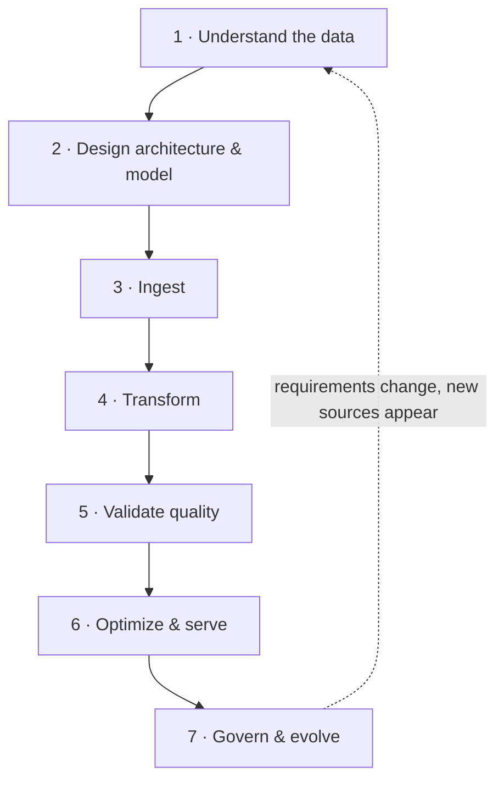

# The Data Engineering Lifecycle — a Primer

*The data engineering lifecycle is the chain every data platform runs — data is generated, ingested, stored, transformed, and served, with security, orchestration, and DataOps running underneath every stage; Phase 0 of this framework pins this primer to a spoken walkthrough (the G0 voice memo), so read it until you can explain each stage out loud with no notes.*

## The Lifecycle at a Glance

A real project meets the stages in this order:

| Stage | Lifecycle term | Key question | Typical AWS services |
|---|---|---|---|
| 1. Understand the data | Generation | What types, how much, how fast? | — (analysis, not tools) |
| 2. Design & model | Storage | Warehouse, lake, or both? What schema? What file format? | S3, Redshift, Lake Formation, Glue Schema Registry |
| 3. Ingest | Ingestion | How does data enter the platform? | Kinesis, DMS, Glue, AppFlow |
| 4. Transform | Transformation | How does raw become useful? | Glue, EMR, Lambda, Step Functions, MWAA |
| 5. Validate quality | DataOps undercurrent | Can the output be trusted? | Glue Data Quality, Glue DataBrew |
| 6. Optimize & serve | Serving | Is it fast and cheap to query? | Redshift, Athena, S3 partitioning |
| 7. Govern & evolve | Data-management undercurrent | Can I trace it? Can I change it safely? | Glue Schema Registry, DataZone, Neptune |

Decisions cascade. The type and properties of the data (Stage 1) decide lake vs. warehouse (Stage 2), which decides ETL vs. ELT (Stage 4), which decides what gets optimized (Stage 6). Jumping straight to tools without Stage 1 is the classic beginner mistake.

## Stage 1 — Understand the Data (Generation)

Before choosing any technology, characterize what you are dealing with.

**Three types of data:**

- **Structured** — organized in a defined schema, rows and columns, easily queryable. Examples: database tables, consistent CSV files, spreadsheets.
- **Semi-structured** — has some structure through tags or hierarchies, but no rigid schema. Examples: JSON, XML, log files, email headers.
- **Unstructured** — no predefined structure; needs preprocessing before it is queryable. Examples: free text, images, audio, video.

First task on any project: inventory every source and label it. Mostly structured → a warehouse can work. Any mix → you need a lake (or lakehouse). Unstructured data always means more transformation work ahead.

**Three properties — the "3 Vs":**

- **Volume** — how much. Gigabytes to petabytes. Drives storage choice, cost planning, and partitioning strategy.
- **Velocity** — how fast it arrives. This is the biggest fork in the road: low velocity → batch pipelines; high velocity → streaming pipelines. Decide early — the two architectures look very different.
- **Variety** — how many types and sources. High variety reinforces the lake decision.

On AWS: structured → RDS, Redshift; semi-structured → DynamoDB, S3 + Athena; unstructured → S3. Volume → S3 scales without practical limits. Velocity → Kinesis for streams, Glue for batch.

## Stage 2 — Design the Architecture & Model the Data (Storage)

These are design-time decisions. They are expensive to reverse, so they come before any building.

**Warehouse vs. lake:**

| Dimension | Data Warehouse | Data Lake |
|---|---|---|
| Schema | Schema-on-**write** (defined before loading) → ETL | Schema-on-**read** (defined at query time) → ELT |
| Data types | Primarily structured | Structured and unstructured |
| Agility | Lower — schema is fixed up front | Higher — accepts raw data as-is |
| Cost | Higher; optimized for complex queries | Cheap storage; cost shifts to processing |

Choose a **warehouse** when sources are structured and BI is the main use case. Choose a **lake** when data is mixed, volume is large, or future needs are uncertain. In practice most platforms use **both**: raw data lands in the lake, refined data moves to the warehouse. Write the decision down — every later stage references it.

On AWS: lake → S3 + Glue Data Catalog + Athena; warehouse → Redshift; combined → S3 lake feeding Redshift.

**Two related patterns:**

- **Lakehouse** — one architecture with both behaviors: lake flexibility plus warehouse reliability (ACID transactions on lake storage, via table formats like Delta Lake or Apache Iceberg). Pick it when ML teams need raw files and analysts need fast, transactional SQL on the same data. On AWS: Lake Formation over S3, queried via Athena or Redshift Spectrum.
- **Data mesh** — a management paradigm, not a technology: domain teams own "data products," under federated governance with central standards. Relevant when organizing many teams, not one pipeline. On AWS: Amazon DataZone, plus Lake Formation permissions.

**Data modeling.** In a warehouse, model before loading. The standard shape is the **star schema**: **fact tables** hold measurable events (sales, clicks — one row per event); **dimension tables** hold descriptive context (customer, product, date); primary/foreign keys link them. Derive the model from the business questions ("revenue per product per month" → sales fact + product and date dimensions). In a pure lake, modeling is deferred until you shape curated tables.

**File formats.** Chosen at design time, per zone of the platform, because format drives cost and speed everywhere downstream:

| Situation | Pick | Why |
|---|---|---|
| Humans open/edit it; small data; spreadsheet exchange | CSV | Universal, readable |
| API payloads, configs, nested or flexible records | JSON | Flexible schema, nesting |
| Data in motion between systems; schema will change | [Avro](https://avro.apache.org/) | Row-oriented binary with embedded schema |
| Data at rest for analytics; big scans of few columns | [Parquet](https://parquet.apache.org/) | Columnar → less I/O, better compression |

Common pipeline: ingest as JSON/CSV into the raw zone → transform → store the curated zone as Parquet. Athena and Redshift Spectrum are dramatically cheaper and faster on Parquet because they scan fewer bytes.

**Schema evolution — plan it now.** Schemas will change. Pick formats that tolerate change (Avro, Parquet) and plan a schema registry from day one; retrofitting evolution onto a frozen-schema pipeline is painful. On AWS: Glue Schema Registry (discovery, compatibility checking, validation). The operational side is Stage 7.

## Stage 3 — Ingest (Ingestion)

The design exists; now connect real sources and land the data. For each source from Stage 1, pick a connection method:

- Relational databases → **JDBC** (platform-independent, Java-based) or **ODBC** (driver-based, language-independent) connectors
- SaaS tools and web services → **APIs**
- Servers and applications → ship their **raw logs**
- Real-time events (clicks, IoT, transactions) → **streams**

Then apply the velocity decision per source: **batch** (nightly or hourly loads — simpler, cheaper) or **streaming** (continuous — only when consumers genuinely need fresh data).

On AWS: databases → Glue connections, DMS; APIs → AppFlow, Lambda; logs → Kinesis Data Firehose, CloudWatch Logs; streams → Kinesis Data Streams, MSK (Kafka).

## Stage 4 — Transform (Transformation)

Raw data has landed; turn it into something clean, consistent, and shaped for analysis. This is where data engineers spend most of their time.

**ETL = Extract, Transform, Load.** Extract raw data from sources while preserving integrity. Transform it: cleanse (dedupe, fix errors), enrich from other sources, reformat dates and strings, aggregate, handle missing values. Load into the target, in batches or as a stream.

**ETL vs. ELT is already decided** by Stage 2: warehouse (schema-on-write) → ETL, transform before loading; lake (schema-on-read) → ELT, load raw first, transform inside the platform. The combined pattern does both: EL into the lake, then T on the way to the warehouse.

Build one pipeline per source or per target table: define the extract (Stage 3 connection), the transform list, and the load target and mode.

On AWS: Glue is the flagship ETL service; EMR (Spark) for heavy lifting; Lambda for light event-driven transforms.

**Orchestration (undercurrent — set it up as you build).** Pipelines must run automatically, never by hand. More than one step means you need scheduling, dependencies ("load only after transform succeeds"), retries, and failure alerts. On AWS: EventBridge for schedules and event triggers; Step Functions for state machines; MWAA (managed Airflow) for complex DAGs; Glue Workflows for Glue-only pipelines.

**Sampling.** Profile a sample of a huge dataset instead of scanning it all, and develop transforms against a sample before full runs. **Random** sampling when data is uniform; **stratified** (sample within subgroups) when small-but-important groups must not be missed; **systematic** (every n-th record) as a cheap approximation. Glue DataBrew and Athena (`TABLESAMPLE`) support this.

**Data skew.** Unequal distribution of data across partitions or nodes in a distributed system — the "celebrity problem": one hot key overloads one partition while others idle. Symptom: nine workers finish in minutes, one runs for hours. Remedies: **salting** (add a random factor to hot keys — the classic first move), adaptive or custom partitioning, repartitioning, sampling to understand the distribution. On AWS this matters in Glue/EMR Spark jobs and in choosing Redshift distribution keys — a bad DISTKEY is built-in skew.

## Stage 5 — Validate & Assure Quality (DataOps)

The pipeline runs — but is the output right? Four dimensions of data quality:

| Dimension | Meaning | Typical checks |
|---|---|---|
| **Completeness** | All required data is present | Null counts, % populated fields |
| **Consistency** | Values agree across datasets and periods | Cross-field and cross-source comparison |
| **Accuracy** | Data is correct and represents reality | Validation against trusted sources and rules |
| **Integrity** | Relationships stay correct over the lifecycle | Referential (foreign-key) checks |

Use them twice. **Profile first**, while exploring new sources — measure null rates, ranges, and distributions so transforms handle reality, not assumptions. **Validate continuously** — build the four checks into every pipeline as automated gates after transformation; fail or quarantine bad rows before they reach the curated zone. A pipeline without quality gates fails silently.

On AWS: Glue Data Quality (rule-based checks), Glue DataBrew (profiling).

## Stage 6 — Optimize & Serve (Serving)

Data is clean and loaded; make it fast and cheap for consumers. Optimize only once real query patterns exist — before that it is guesswork.

- **Indexing** — avoid full table scans; slow lookups on specific values → index those columns.
- **Partitioning** — reduces data scanned per query, enables parallelism, and eases lifecycle management (drop old partitions). Queries always filter on date or region → partition on that column. In a lake this is the S3 folder layout: `s3://bucket/data/year=2026/month=08/`.
- **Compression** — less storage, fewer disk reads, faster transfer (GZIP, ZSTD, LZOP, BZIP2). Columnar formats compress far better because similar values sit together; Parquet + ZSTD/GZIP is the standard combo.

On AWS: S3 partition layout + Parquet drive Athena cost and speed. Redshift has sort keys (indexing role), distribution styles (partitioning role), and column compression encodings. Revisit this stage whenever consumers complain about speed or cost.

## Stage 7 — Govern, Document & Evolve (Data Management)

The pipeline is live; keep it explainable, compliant, and safe to change.

**Data lineage** traces the flow and transformation of data from source to final destination. You rely on it when a dashboard number looks wrong and you must trace it back through every transform, and when an auditor asks where a figure came from. Start capturing it as soon as pipelines multiply — retrofitting is much harder. On AWS: Spline agents on Glue Spark jobs feeding Neptune; Amazon DataZone.

**Schema evolution — operational side.** When a source adds a column, changes a type, or drops a field: register the new schema version, let the registry verify backward compatibility, update transforms, then deploy. Old records must stay readable. This is where the Stage 2 preparation pays off — or where unprepared pipelines shatter.

## Undercurrents — Present at Every Stage

- **Security** — least-privilege access (IAM), encryption at rest and in transit (KMS, TLS), fine-grained permissions on lake data (Lake Formation). Applied from Stage 2 onward, not bolted on later.
- **Orchestration** — automated scheduling, dependencies, retries, alerts (Stage 4.2 above; it governs the whole platform).
- **DataOps** — automation, monitoring, and quality gates as habits: version control for every script and config, automated validation on every run, observability on every pipeline.
- **SQL and Git** — the two everyday tools. SQL is the working language of transformation, validation, and serving (aggregation, `GROUP BY`, joins, conditional aggregation, regex matching). Git versions all pipeline code, SQL, and infrastructure definitions from day one.

## A Worked Mini-Scenario

An e-commerce company wants daily sales dashboards plus a foundation for future ML.

1. **Understand:** orders database (structured), clickstream (semi-structured JSON, high velocity), product images (unstructured). ~50 GB/day. Mixed variety, one high-velocity source.
2. **Design:** lake on S3 for everything raw + Redshift for dashboard tables. Curated zone in Parquet. Star schema: `fact_sales` + `dim_product`, `dim_customer`, `dim_date`. Clickstream schema registered in Glue Schema Registry.
3. **Ingest:** orders → nightly JDBC batch; clickstream → Kinesis stream; images → straight to S3.
4. **Transform:** Glue jobs (ELT in the lake) dedupe, enrich, and aggregate; Step Functions orchestrates nightly. One slow job → one mega-customer's hot key → skew → fixed with salting.
5. **Validate:** automated post-run checks — no null order IDs (completeness), totals match source (accuracy), every sale's product exists in `dim_product` (integrity). Failures quarantine the batch.
6. **Optimize:** dashboards filter by date → partition curated zone by `year=/month=/day=`; Parquet + compression cuts Athena scan costs ~90%; Redshift sort key on `sale_date`.
7. **Govern:** lineage captured from Glue jobs. Months later the orders team adds a `discount_code` column; the registry validates it as backward-compatible and pipelines keep running.

Throughout: every script and query in Git; every transform and check in SQL.

## Say It Out Loud — the G0 Checklist

You should be able to answer each of these in one or two spoken sentences, with no notes:

1. What are the three types of data and the three Vs, and what do they decide?
2. Warehouse vs. lake — what is the real difference, and why do most platforms use both?
3. How does data get in, and when do you stream instead of batch?
4. What is ETL vs. ELT, and who made that choice for you?
5. What are the four quality dimensions, and where do the gates go?
6. What are the three levers that make queries fast and cheap?
7. What do lineage and a schema registry each protect you from?
